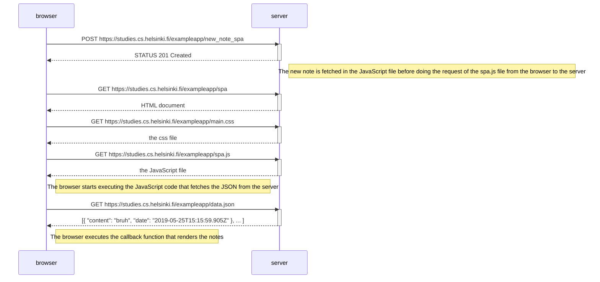

```mermaid
      sequenceDiagram
          participant browser
          participant server
	  
	  browser->>server: POST https://studies.cs.helsinki.fi/exampleapp/new_note_spa
          activate server
          server-->>browser: STATUS 201 Created
          deactivate server
	  
	  Note right of server: The new note is fetched in the JavaScript file before doing the request of the spa.js file from the browser to the server
		  
          browser->>server: GET https://studies.cs.helsinki.fi/exampleapp/spa
          activate server
          server-->>browser: HTML document
          deactivate server

          browser->>server: GET https://studies.cs.helsinki.fi/exampleapp/main.css
          activate server
          server-->>browser: the css file
          deactivate server

          browser->>server: GET https://studies.cs.helsinki.fi/exampleapp/spa.js
          activate server
          server-->>browser: the JavaScript file
          deactivate server

          Note right of browser: The browser starts executing the JavaScript code that fetches the JSON from the server

          browser->>server: GET https://studies.cs.helsinki.fi/exampleapp/data.json
          activate server
          server-->>browser: [{ "content": "bruh", "date": "2019-05-25T15:15:59.905Z" }, ... ]
          deactivate server

          Note right of browser: The browser executes the callback function that renders the notes
```
